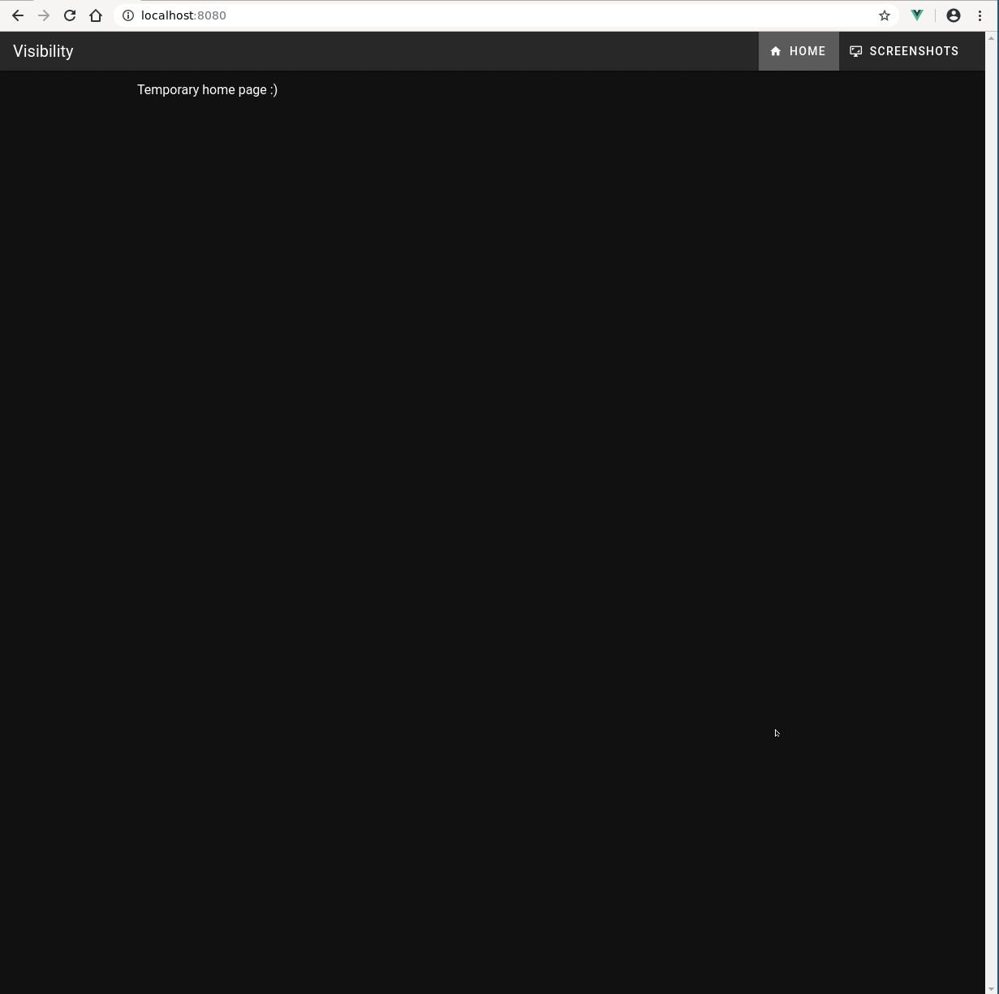

Takes screenshots. Supports historical screenshots. Pretty fast.

Install and run:

```
git clone https://github.com/lynch-a/visibility.git
docker-compose up
```

take it down:

`docker-compose down`

if you edit the code and need to rebuild the image:

`docker-compose up --build`


